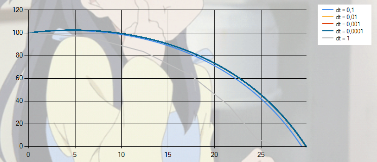
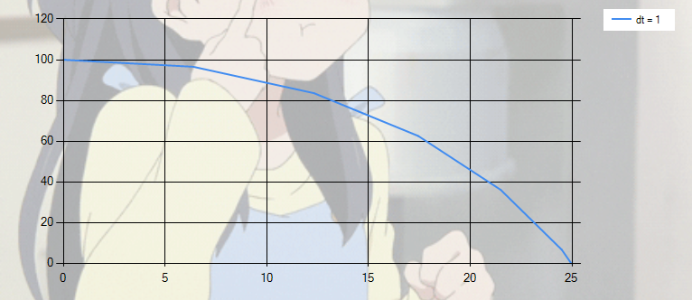
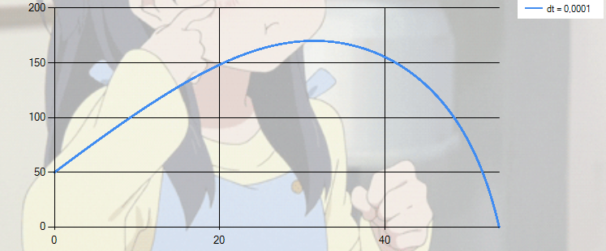
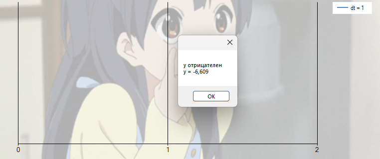

### Моделирование полёта тела в атмосфере

**Задание:**  
Реализовать приложение для моделирования полёта тела в атмосфере.  
Предусмотреть возможность ввода шага моделирования и вывода результатов.

Выполнить моделирование **без очистки предыдущих результатов** для различных шагов моделирования, сравнить траектории и заполнить таблицу:

| Шаг моделирования, с | 1 | 0.1 | 0.01 | 0.001 | 0.0001 |
|----------------------|---|-----|------|-------|--------|
| Дальность полёта, м |26.636|29.324|29.751|29.794|102.448|
| Максимальная высота, м |100|102.083|102.412|102.445|29.798|
| Скорость в конечной точке, м/с |30.878| 29.599|29.582|29.571|29.570|

*График, где отображены все траектории всех шагов моделирования*
График построен при следующих исходных данных:
- начальная высота: 100 м;
- масса тела: 1 кг;
- угол броска: 45°;
- характерный размер: 0.1 м;
- начальная скорость: 10 м/с.  
Видно, что при уменьшении шага моделирования, увеличивается точность численного решения.  
---
Например, при шаге dt = 1 траектория становится угловатой, что связано с большой погрешностью интегрирования:
  
---
При изменении исходных параметров, очевидно, изменяется и траектория
полёта тела. Так, при начальной высоте = 50 м, угле броска = 80 и начальной скорости = 100 м/с траектория становится более изогнутой, а точка максимальной высоты смещается влево;
  
---
Так-же, при шаге dt = 1, и высоте = 0, траектория полета, по сути, будет уходить в отрицательную часть по оси y:

