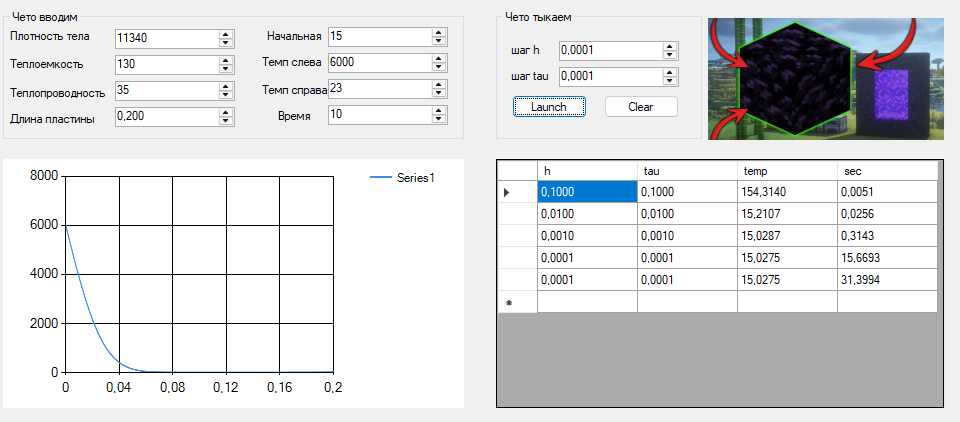

### Метод конечных разностей для уравнения теплопроводности

**Задание:**  
Реализовать моделирование изменения температуры в пластине на основе одномерного уравнения теплопроводности с использованием метода конечных разностей.

Выполнить моделирование с различными шагами по времени и по пространству.
Заполнить таблицу значений температуры в центральной точке пластины.

| шаг по пространству \ по времени| 0.1 | 0.01 | 0.001 | 0.0001 |
|----------------------|-----|------|-------|--------|
| 0.1 | 154.3140 | 154.3431 | 154.3461 | 154.3463 |
| 0.01 | 15.2443 | 15.2107 | 15.2075 | 15.2071 |
| 0.001 | 15.0440 | 15.0300 | 15.0287 | 15.0286 |
| 0.0001 | 15.0427 | 15.0289 | 15.0277 | 15.0275 |

  

*Общий вид программы, график, майнкрафт, таблица*  

Я решил посмотреть, что станет со свинцовой дверью, длиной 20см при ядерном взрыве.
Параметры свинца:
- Плотность тела (ρ): 11340 кг/м³;
- Удельная теплоемкость(C): 130 Дж/(кг⋅ºC);
- Коэффициент теплопроводности (λ): 46 Вт/(м⋅ºC);
- Начальная температура (T₀): 15ºC;
- Температура слева (Tleft): 6000ºC;
- Температура справа (TRight): 23ºC;
- Время моделирования (t): 10 с.    
Видно, что при шаге по пространству (h) = 0.1, температура пластины экстремально высокая.  Это происходит из-за того, что точность шага близка к длине пластины, поэтому точность вычислений страдает.

Температура в центре меняется незначительно, так как теплопроводность свинца мала.

---
Вывод: за свинцовой дверью толщиной 20 см можно прожить при ядерном взрыве как минимум 10 секунд, так как внутренняя поверхность практически не нагревается.
