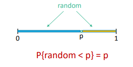
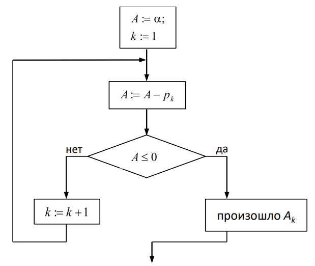
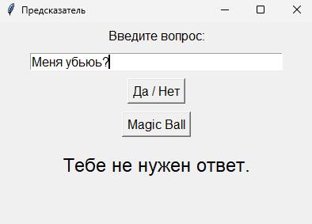

# Лабораторная работа №5
## Моделирование случайных событий
**Часть 1:**  
Приложение «Скажи “да” или “нет”».

**Часть 2:**  
Приложение «Шар предсказаний» (Magic 8-Ball).
___
### Немного теории

Геометрически (_Рисунок 1_), **вероятность** можно представить как отрезок с интервалом [0, 1]:

$$
P\{\text{random} < p\} = p,
$$

где random -- случайная величина, равномерно распределенная на интервале [0, 1], а p -- вероятность наступления события.



_Рисунок 1. Геометрическая интерпретация._

События $$A_1, A_2, \dots, A_m$$ образуют **полную группу** попарно несовместных событий, если:
- $$P\{A_i\} = p_i$$, и
- $$\sum_{i=1}^{m}p_i = 1$$
___
### Реализация
> Программа написана на русском питоне, надеюсь вам понравится. В файле `междумордие_лаб05.крп` реализован интерфейс, в файле `помощь.крп` основная логика, `лаба05.крп` - main.

**Часть 1:**   Приложение «Скажи “да” или “нет”».

Здесь все просто: получаем вероятность (`р`), затем генерируем случайное число (`альфа`) и сравниваем его с вероятностью через конструкцию если/Иначе 
```py
Класс Ответ:
    Функция __Подготовка__(сам, р):
        сам.р = р

    Функция получить_ответ(сам):
        альфа = Случ.От0До1()

        если альфа < сам.р:
            Вернуть "Да"
        Иначе:
            Вернуть "Нет"
```
___
**Часть 2:**   Приложение «Шар Предсказаний».
В функции `получить_ответ` находится реализация самого алгоритма выбора ответа. Алгоритм основан на последовательном вычитании вероятностей из случайного числа до выполнения условия $$A \leq 0$$. Алгоритм изображен на рисунке 2:



_Рисунок 2. Алгоритм генерации события из группы событий._

```py
Функция получить_ответ(сам):
        А = Случ.От0До1()
        к = 0
        Пока к < Длина(сам.вероятность):
            А = А - сам.вероятность[к]
    
            если А <= 0:
                Вернуть сам.ответы[к]
    
            к += 1
    
        Вернуть сам.ответы[-1]
```

    Один умный человек ~~(Стас)~~ сказал, что нормализовать вектор вероятностей было бы хорошим решением. Ну раз так, то я согласился и сделал. Так появилась функция `нормализовать`. 

Нормализация необходима для того, чтобы вероятности всегда образовывали полную группу событий т.е. сумма всех вероятностей всегда равна 1). Как работает: делим все вероятности на сумму вероятностей.

```py
    Функция нормализовать(сам):
        общая_сумма = Сумма(сам.вероятность)

        если общая_сумма > 0:
            Для ай в Ряд(Длина(сам.вероятность)):
                сам.вероятность[ай] = сам.вероятность[ай] / общая_сумма
```
___
Вид интерфейса, хоть там нет ничего интересного, представлен на рисунке 3: 



_Рисунок 3. Интерфейс приложения._
___
### Вывод

В ходе лабораторной работы было реализовано моделирование случайных событий с использованием генератора случайных чисел.

Были разработаны приложения «Скажи “да” или “нет”» и «Шар предсказаний», в которых выбор ответа осуществляется на основе заданных вероятностей.

В результате были получены навыки работы с вероятностями и моделирования случайных событий.
