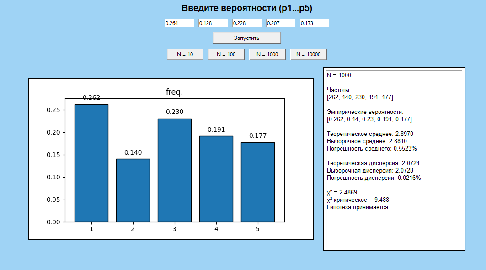
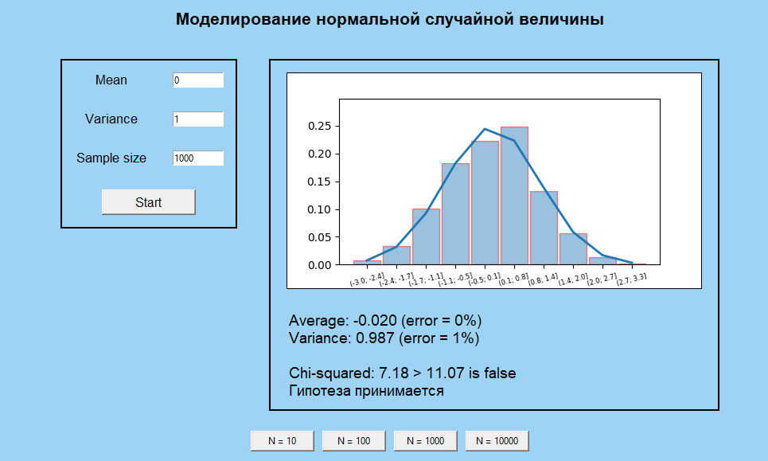

# Лабораторная работа 6.
## Имитационное моделирование дискретных случайных величин

**Задание:**
- реализовать генерацию дискретной случайной величины, заданной рядом распределения;
	- вычислить эмпирические вероятности;
	- вычислить выборочные среднее и дисперсию, их относительные погрешности;
	- вычислить статистику χ² и применить критерий χ² при:
	  - N = 10, 100, 1 000, 10 000;
- Реализовать генератор нормальной случайной величины, 
	- построить гистограммы 
	- сравнить точность моделирования при разных объёмах выборки.
- сделать вывод.

### **Часть 1.** Реализация

Для генерации дискретной случайной величины используется метод последовательного вычитания вероятностей. Это делается в классе `DiscreteGenerator`:
```py
    def generate(self):
        A = random.random()
        k = 0

        while k < len(self.prob):
            A -= self.prob[k]

            if A <= 0:
                return self.val[k]

            k += 1

        return self.val[-1]
        
    def experiment(self, N):
        counts = [0] * len(self.val)

        for _ in range(N):
            x = self.generate()
            counts[self.val.index(x)] += 1
        return counts
```
Случайное число равномерно распределено на интервале [0,1). Мы последовательно вычитаем вероятности, пока не попадём в соответствующий интервал.

Метод `experiment` выполняет N испытаний и подсчитывает частоты

После генерации, в классе `Calculate`, вычисляются:
- Эмпирическая вероятность:
  - p̂_i = n_i / N
- Теоретическое среднее:
  - M = Σ (x_i * p_i)
- Выборочное среднее:
  - M̂ = Σ (x_i * p̂_i)
- Теоретическая дисперсия:
  - D = Σ (x_i² * p_i) - M²
- Выборочная дисперсия:
  - D̂ = Σ (x_i² * p̂_i) - M̂²
- Относительная погрешность:
  - δ = |X_теор - X_эмп| / |X_теор|

```py
    def empirical_prob(self):
        p_emp = []

        for i in range(len(self.counts)):
            p_emp.append(self.counts[i] / self.N)

        return p_emp

    def mean(self):
        s = 0

        for i in range(len(self.val)):
            s += self.val[i] * self.prob[i]

        return s

    def var(self, mean):
        s = 0

        for i in range(len(self.val)):
            s += self.val[i] * self.val[i] * self.prob[i]

        s = s - mean * mean

        return s
        
    def relative_error(self, theor, emp):
        if theor == 0:
            return 0
        return abs(emp - theor) / abs(theor)
```

В коде один и тот же метод `mean()` считает и теоретическое, и выборочное среднее. Если передать параметр `prob`, мы получаем теоретическое значение, а если передать `p_emp`, то выборочное. Аналогично и для дисперсии:

```py
        M_theor = calc_theor.mean()
        D_theor = calc_theor.var(M_theor)
        
        M_emp = calc_emp.mean()
        D_emp = calc_emp.var(M_emp)
```

Статистика χ² вычисляется по формуле:
- χ² = Σ (n_i² / (N * p_i)) - N  
Гипотеза принимается, если χ² меньше критического значения.
___
### **Часть 2.** Реализация.

Для генерации непрерывных случайных величин был выбран метод суммирования, основанный на центральной предельной теореме. Здесь мы считаем сумму 12 равномерно распределённых случайных чисел и отнимаем 6, чтобы получить стандартное нормальное распределение
- z = (α₁ + α₂ + ... + α₁₂) - 6
Чтобы получить нормальную величину с заданными параметрами, мы преобразуем стандартную нормальную величину z по формуле: 
- x = μ + σ * z, где:
  - μ — заданное среднее
  - σ — среднеквадратичное отклонение (σ = sqrt(D))
  - D — заданная дисперсия

```py
 def generate_standart_sum(self):
        z = 0

        for _ in range(12):
            z += random.random()

        return z - 6

    def generate(self):

        z = self.generate_standart_sum()
        return self.mean + math.sqrt(self.var) * z
```

Дальше считаем по следующим формулам:
- Выборочное среднее:
  - M̂ = (1 / N) * Σ x_i
- Выборочная дисперсия
  - D̂ = (1 / N) * Σ (x_i²) - (M̂)²
- Относительная погрешность
  - δ = |X_теор - X_эмп| / |X_теор|
- Ширина интервала
  - h = (x_max - x_min) / k
- Эмпирические вероятности (для интервалов)
  - p̂_i = n_i / N
- Теоретическая вероятность интервала
  - p_i = F(right_i) - F(left_i)
- Критерий χ²
  - χ² = Σ ((n_i - N * p_i)² / (N * p_i))

```py
def empirical_mean(self):
        s = 0

        for x in self.sample:
            s += x

        return s / self.N

    def empirical_var(self, emp_mean):
        s = 0

        for x in self.sample:
            s += x * x

        return s / self.N - emp_mean**2

    def normal_cdf(self, x):
        sigma = math.sqrt(self.var)
        z = (x - self.mean) / (sigma * math.sqrt(2))
        return 0.5 * (1 + math.erf(z))

    def theoretical_probs(self, intervals):
        probs = []

        for left, right in intervals:
            p = self.normal_cdf(right) - self.normal_cdf(left)
            probs.append(p)

        return probs

    def chi_square(self, counts, probs):
        chi = 0

        for i in range(len(counts)):
            expected = self.N * probs[i]

            if expected > 0:
                chi += (counts[i] - expected) ** 2 / expected

        return chi
        
    def histogram(self, k):
        min_val = min(self.sample)
        max_val = max(self.sample)

        h = (max_val - min_val) / k

        intervals = []
        counts = [0] * k

        for i in range(k):
            left = min_val + i * h
            right = left + h
            intervals.append((left, right))

        for x in self.sample:
            for i in range(k):
                left, right = intervals[i]

                if i == k - 1:
                    if left <= x <= right:
                        counts[i] += 1
                else:
                    if left <= x < right:
                        counts[i] += 1

        freq = []
        for c in counts:
            freq.append(c / self.N)

        return intervals, counts, freq
```
___
### Вид программы

На рисунке 1 представлен вид программы для дискретных случайных величин.



_Рисунок 1. Вид программы для ДВС_

На рисунке 2 изображен вид программы для непрерывных случайных величин.



_Рисунок 1. Вид программы для ДВС_


___
### Вывод.

Муторная и сложная лаба, но зато красиво получилось графики порисовать.
