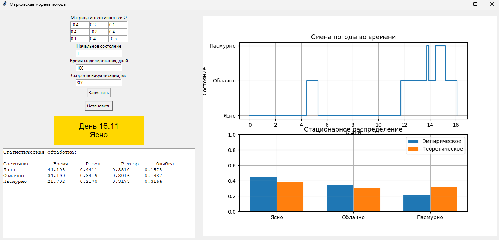

# Лабораторная работа 7.
## Марковская модель погоды

**Задание:**  
Смоделировать погоду по дням:

- 1 — ясно  
- 2 — облачно  
- 3 — пасмурно  

Единица времени — **1 день**.  
Задать интенсивности переходов между состояниями.

**Требования:**
1. Выполнить моделирование в «реальном» времени с визуализацией.
2. Провести статистическую обработку результатов.
3. Сравнить эмпирическое распределение с теоретическим стационарным.

### Реализация
Для моделирования использовалась непрерывная цепь Маркова.   
Матрица интенсивностей переходов задаёт скорость переходов между состояниями.   
Диагональные элементы матрицы вычисляются как сумма интенсивностей переходов из данного состояния:

$$
\q_{ii} = -\sum_{j \neq i} \q_{ij}
$$

Время пребывания в состоянии распределено по экспоненциальному закону:

$$
\tau = -\frac{\ln(\alpha)}{\lambda}
$$

где: 
- $$\(\alpha \in (0,1)\)$$ - случайное число;
- $\lambda = -q_{ii}$ — интенсивность выхода из состояния $i$;

Следующее состояние выбирается как дискретная случаная величина с вероятностями:
$$ p_{ij} = \frac{q_{ij}}{-q_{ii}} $$


Генерация следующего состояния выполняется в классе `MarkovWeatherGenerator`:

```python
def generate_next(self, state):
    i = state - 1
    rate = -self.Q[i][i]

    tau = -math.log(random.random()) / rate

    probs = []
    next_states = []

    for j in range(3):
        if j != i:
            probs.append(self.Q[i][j] / rate)
            next_states.append(j + 1)

    A = random.random()

    for k in range(len(probs)):
        A -= probs[k]

        if A <= 0:
            return next_states[k], tau

    return next_states[-1], tau
```

Сначала генерируется время нахождения в текущем состоянии, затем случайным образом выбирается следующее состояние процесса.

---

В методе `expirement()` выполняется моделирование на интервале времени [0, T].

Во время моделирования:
- фиксируются моменты смены состояний;
- сохраняется последовательность состояний;
- подсчитывается суммарное время пребывания в каждом состоянии.

```python
def experiment(self, T):
    t = 0
    state = self.start_state

    times = [0]
    states = [state]
    durations = [0, 0, 0]

    while t < T:
        new_state, tau = self.generate_next(state)

        if t + tau > T:
            durations[state - 1] += T - t
            break

        durations[state - 1] += tau

        t += tau
        state = new_state

        times.append(t)
        states.append(state)

    return times, states, durations
```
Таким образом моделируется случайный процесс смены погоды во времени.

---

После завершения моделирования вычисляется эмпирическое стационарное распределение вероятностей.

Эмпирическая вероятность состояния определяется как:

$$ \hat p_i = \frac{T_i}{T} $$

где: 
- $T_i$ — суммарное время пербывания в сотоянии;
- $T$ — общее время моделирования.

```python
def empirical_distribution(self, durations):
    total = sum(durations)

    p = []

    for d in durations:
        p.append(d / total)

    return p
```

---

Теоретическое стационарное распределение находится из системы:

$$ \pi Q = 0 $$ 

с дополнительным условием нормировки:

$$ \sum_i \pi_i = 1 $$

В программе решение находится с помощью библиотеки `numpy`:

```python
def stationary_distribution(self):
    A = self.Q.T.copy()
    b = np.zeros(3)

    A[2] = np.ones(3)
    b[2] = 1

    pi = np.linalg.solve(A, b)

    return pi.tolist()
```

Также вычисляется относительная погрешность:

```py
def relative_error(self, theor, emp):
    if theor == 0:
        return 0

    return abs(emp - theor) / abs(theor)
```

___
### Приложение
На рисунке 1 представлена визуализация приложения.

_Рисунок 1. Визуализация приложения_

___

### Вывод

В ходе лабораторной работы была реализована модель погоды на основе непрерывной цепи Маркова.
